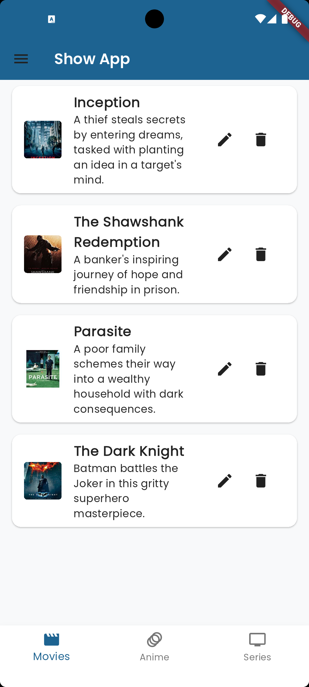
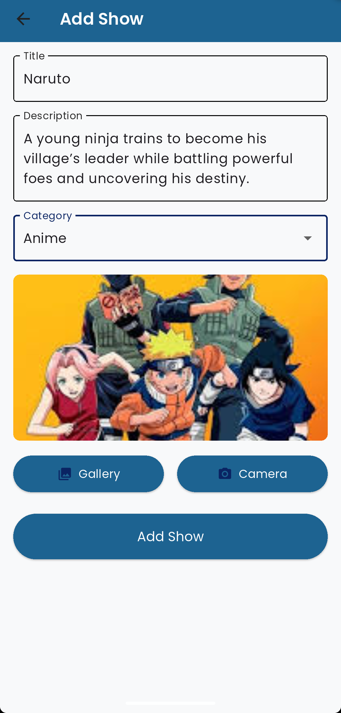
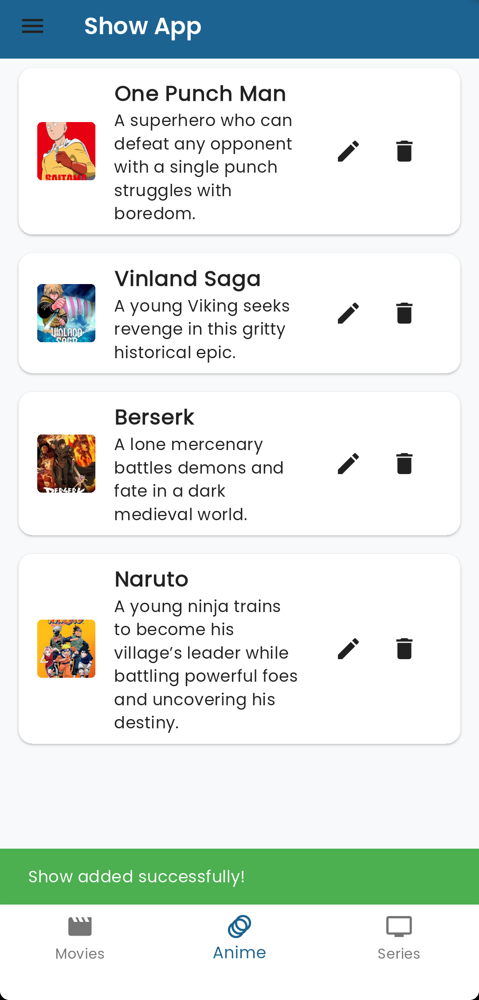
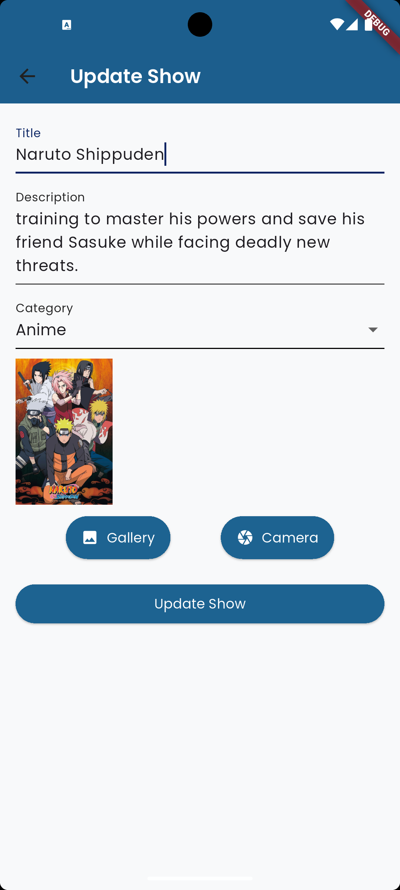
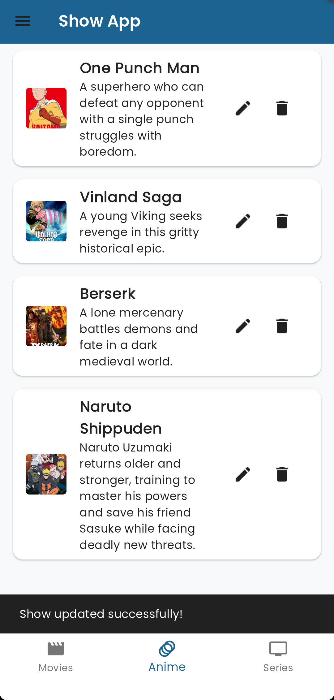
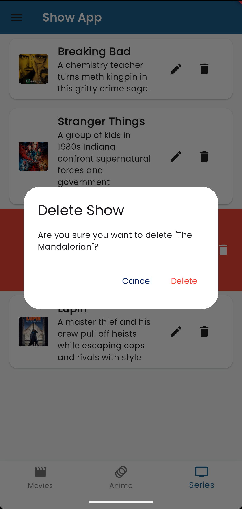
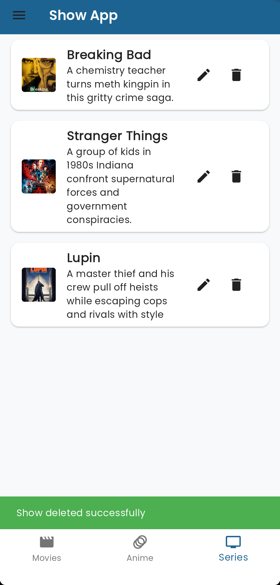

# 🎬 Flutter + Node.js Show Manager App
### A mobile app for managing movies, series, and anime with a `Node.js` backend.

 
# 📌 Objectives
- Build a **Flutter app** with Node.js backend integration
- Implement **CRUD operations** with swipe-to-delete
- Add **image upload** (gallery/camera)
- Create login/auth flow

# 🛠️ Key Features
🔐 Important Note (Credentials)

**PS**: For testing purposes, use these demo credentials:  
**Email**: `admin@example.com`  
**Password**: `admin123`  
## Add a New Show

1. **Enter Show Details**  
   - 📝 Type a title 
   - 📄 Write a description  
   - 🏷️ Select a category (Movie/Anime/Series) 

2. **Choose an Image**  
   - 📁 Tap "Gallery" to pick from photos  
   - 📸 Or tap "Camera" to take a new picture  

3. **Submit**  
   - ✔️ Tap "Add Show" button  

4. **Confirmation**  
   - ✅ "Show added successfully!" message appears  
   - 🔄 Show list auto-updates with your new entry  

  
  

## Update Existing Show
1. **Select a Show to Edit**  
   - Tap the 🖊️  icon on a show card  

2. **Modify Details**  
   - ✏️ Edit title/description text  
   - 🔄 Change category if needed  
   - 🖼️ Tap image to:  
     - Keep current **OR**  
     - Upload new image (gallery/camera)  

3. **Save Changes**  
   - 💾 Tap "Update Show" button  

4. **Confirmation**  
   - ✅ "Show updated successfully!" appears  
   - 🔄 Changes instantly reflect in the list 

  
  

## Delete with Swipe Gesture

1. **Initiate Deletion**  
   - 👆 Swipe left on any show card  

2. **Confirmation**  
   - 🚨 Red "Delete" button appears  
   - 📢 Dialog asks: _"Are you sure you want to delete..?"_  

3. **Confirm**  
   - Tap **"Delete"** to proceed  
   - _(or "Cancel" to abort)_  

4. **Result**  
   - ✅ _"Show deleted successfully!"_ toast appears  
   - 🔄 List instantly updates  

  
  

